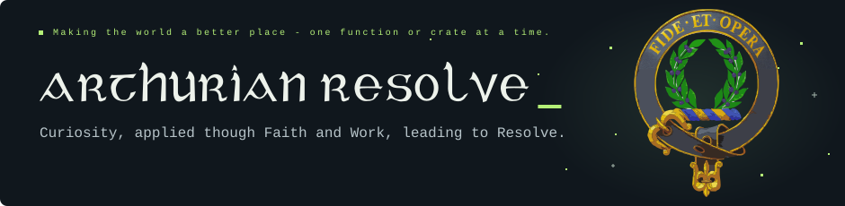

  

<h1 align="center">Hobby programmer. Lifelong learner.</h1>

  Based in Germany · OWASP life member · Usually thinking in Rust, C, or Java.

  I enjoy understanding how things work, improving the tools I use, 
  and turning what I learn into something useful.

  
  &nbsp;
  

<blockquote>
  
Curiosity is the engine of achievement. - Ken Robinson

</blockquote>

<h2>01 / What I work on</h2>

  <strong>Systems &amp; tooling.</strong> Rust utilities, filesystem work, and tools for understanding dependencies. 
  <strong>Security &amp; assurance.</strong> Exploring secure software and structured, machine-readable controls. 
  <strong>Learning by building.</strong> Open-source experiments, maintained forks, and practical refinements.

<h2>02 / Some of my Quests</h2>

<!-- 300 + 639 + the collapsed border = 940px; 31.95% keeps the divider aligned while shrinking. -->
<table>
  <thead>
    <tr><th width="300" align="left">Project</th><th width="639" align="left">What you’ll find</th></tr>
  </thead>
  <tbody>
    <tr>
      <td width="31.95%"><a href="https://github.com/arthurianresolve/fs2-turbo"><strong>fs2-turbo ↗</strong></a></td>
      <td>Extended file and filesystem utilities in Rust. Rust · Maintained fork</td>
    </tr>
    <tr>
      <td><a href="https://github.com/arthurianresolve/cratos-dependents-finder-CLI"><strong>cratos ↗</strong></a></td>
      <td>A CLI for finding consumers of crates and GitHub repositories. Rust · Developer tooling</td>
    </tr>
    <tr>
      <!-- GitHub strips wbr tags; a zero-width space lets the version wrap on narrow screens. -->
      <td><a href="https://github.com/arthurianresolve/extism-with-wasmtime46"><strong>extism-with-wasmtime&#8203;46 ↗</strong></a></td>
      <td>An Extism fork patched for Wasmtime 46. Rust · WebAssembly</td>
    </tr>
    <tr>
      <td><a href="https://github.com/arthurianresolve/OSCAL-DORA-EN"><strong>OSCAL-DORA-EN ↗</strong></a></td>
      <td>Exploring DORA and its supporting acts in OSCAL. OSCAL · Structured controls</td>
    </tr>
  </tbody>
</table>

<h2>03 / Track Record</h2>

<!-- The paired panels share one 940px SVG and scale together without wrapping. -->

  <picture>
    <source media="(prefers-color-scheme: dark)" srcset="https://raw.githubusercontent.com/arthurianresolve/arthurianresolve/output/github-stats-panels-dark.svg" />
    <source media="(prefers-color-scheme: light)" srcset="https://raw.githubusercontent.com/arthurianresolve/arthurianresolve/output/github-stats-panels-light.svg" />
    
  </picture>

<picture>
  <!-- Only the reduced-motion case needs the SVG's playback override. -->
  <source media="(prefers-color-scheme: dark) and (prefers-reduced-motion: reduce)" srcset="https://raw.githubusercontent.com/arthurianresolve/arthurianresolve/output/github-contribution-grid-starship-dark.svg#play-animation" />
  <source media="(prefers-reduced-motion: reduce)" srcset="https://raw.githubusercontent.com/arthurianresolve/arthurianresolve/output/github-contribution-grid-starship-light.svg#play-animation" />
  <source media="(prefers-color-scheme: dark)" srcset="https://raw.githubusercontent.com/arthurianresolve/arthurianresolve/output/github-contribution-grid-starship-dark.svg" />
  <source media="(prefers-color-scheme: light)" srcset="https://raw.githubusercontent.com/arthurianresolve/arthurianresolve/output/github-contribution-grid-starship-light.svg" />
  
</picture>

<blockquote>
  
“This is the oath of a Knight of King Arther’s Round Table and should be for all of us to take to heart. I will develop my life for the greater good. I will place character above riches, and concern for others above personal wealth, I will never boast, but cherish humility instead, I will speak the truth at all times, and forever keep my word, I will defend those who cannot defend themselves, I will honor and respect women, and refute sexism in all its guises, I will uphold justice by being fair to all, I will be faithful in love and loyal in friendship, I will abhor scandals and gossip-neither partake nor delight in them, I will be generous to the poor and to those who need help, I will forgive when asked, that my own mistakes will be forgiven, I will live my life with courtesy and honor from this day forward.”

  
Sir Thomas Malory, <strong><em>Le Morte d’Arthur: King Arthur &amp; the Legends of the Round Table,</em></strong> 1485

</blockquote>

<strong>Always learning. Always another thing to build.</strong>

<a href="https://arthurianresolve.com">arthurianresolve.com</a> &nbsp; · &nbsp; <a href="https://github.com/arthurianresolve">@arthurianresolve</a>

