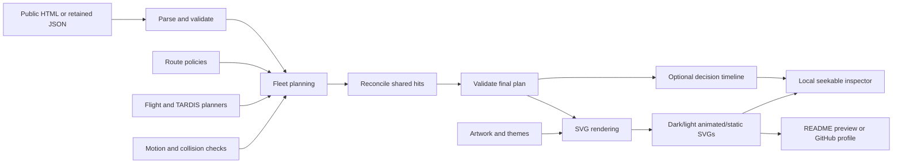

# Code map and contribution animation

Start with `src/starship/fleet.mjs` for behavior and `src/starship/render.mjs` for the SVG. The command-line entry point is `scripts/generate-starship.mjs`. All planning is done in Node; the browser receives a self-contained SVG with CSS keyframes.

## Source map

```text
src/
  starship/           Calendar, fleet planning, validation and SVG rendering
  stats/             Provider SVG allowlist and prepared card layout
  themes.mjs         Shared light/dark palettes
  preview.mjs        README preview builder and restricted local HTTP server
scripts/             Stable command-line entry points and compatibility exports
preview/             Browser templates, styles and diagnostics controls
test/                Tests grouped by behavior and security contract
assets/              Profile artwork and generated SVGs
data/                Retained public inputs for offline reproduction
docs/                Setup, artwork provenance and engineering notes
.preview/            Ignored local diagnostics and comparison artifacts
```

Keep I/O in the command entry points and behavior in its owning module. The
animation modules share one fleet model; further directory layers would make
those relationships harder to follow. Generated assets and retained inputs keep
their existing paths so README links and workflow publication do not churn.

| Module | Responsibility | Main functions |
| --- | --- | --- |
| `scripts/generate-starship.mjs` | Read public HTML or retained JSON; validate and render before writing assets | `generate`, `writePlan` |
| `src/starship/calendar.mjs` | Parse and validate real contribution data | `parseCalendar`, `validateCalendar` |
| `src/starship/routes.mjs` | Select connected routes through actual calendar cells | `findLeastResistanceRoute`, `findHighDensityRoute`, `findRandomDensityRoute` |
| `src/starship/motion.mjs` | Interpolate poses; reserve hull clearance and prevent close following | `createMotion`, `positionAt`, `flightsOverlap`, `firstFollowingAt`, `reserveFlight` |
| `src/starship/flights.mjs` | Armed crossings and Discovery's beam/retreat behavior | `planFlight`, `planDiscovery`, `enterpriseWeapon` |
| `src/starship/damage.mjs` | Chronological damage, explosion clearance, and final hit ownership | `createDamageTimeline`, `reconcileDamage` |
| `src/starship/encounters.mjs` | Safe opening encounter and in-range exchanges across all crossings | `stageEncounter`, `stageFlybyEncounters` |
| `src/starship/discovery-motion.mjs` | Repeating 7/5/3-block bursts and movement-only exhaust intervals | `createDiscoveryMotion` |
| `src/starship/tardis.mjs` | Wave guidance, solid-block avoidance, moving yields, and spin/glide cycles | `createTardisPlanner`, `reverseTardisAt`, `waveHeight`, `pathClearAt` |
| `src/starship/fleet.mjs` | Coordinate launches, encounters, and repeat crossings | `planAnimation` |
| `src/starship/validate.mjs` | Reject invalid final motion, damage, effects, and sprite ownership before output | `validatePlan`, `InvalidPlanError` |
| `src/starship/diagnostics.mjs` | Export recorded decisions in playback seconds and fingerprint their SVGs | `createDiagnostics` |
| `src/starship/keyframes.mjs` | Remove only exactly redundant movement keyframes at rendered CSS offsets | `compactMotionFrames` |
| `src/starship/artwork.mjs` | Separately documented ship sprites | `shipArtwork` and each ship's artwork function |
| `src/starship/render.mjs` | Paint cells, weapons, beams, ships, shields, and labels | `renderStarship` and its named rendering helpers |
| `src/starship/config.mjs` | Shared units, hull geometry, scale, and shield envelope | Constants only |
| `src/themes.mjs` | Shared palette, without importing ship artwork into stats | `THEMES` |
| `src/stats/svg.mjs` | Size-bounded passive SVG allowlist and local replacement CSS | `sanitizeStatsSvg` |
| `src/stats/card.mjs` | Validate one card, then render four layouts from private normalized fragments | `prepareStatsCard`, `splitStatsCard` |
| `scripts/generate-stats.mjs` | Read or fetch a card; write panels and its normalized snapshot | `generateStats` |
| `src/preview.mjs` | Build the README preview and enforce local HTTP access restrictions | `buildPreview`, `createPreviewServer` |
| `scripts/preview.mjs` | Preview build/serve command | CLI only; original exports retained |
| `preview/diagnostics.mjs` | Filter decisions and seek all SVG animations together in the local inspector | `loadAnimation`, `seek`, `renderEvents` |

`scripts/fleet-motion.mjs` and the generator/preview exports preserve the original command import paths. New implementation and behavior tests import their owning modules directly; entry-point tests still exercise the compatibility exports. Node 24 remains the minimum runtime. No package dependencies or runtime framework are required.

## Input and preview security

Calendar tooltips must be plain English text. The parser extracts only the
numeric count and rejects markup or entities instead of deleting tags, which
could join digits into a different count. The tooltip text is never retained or
rendered; date/value validation and SVG text escaping remain separate checks.

`prepareStatsCard` always sanitizes and validates its input before returning a
render function. Its normalized fragments remain private to that function, so
rendering another theme cannot bypass validation or mutate later renders. The
batch generator prepares once instead of sanitizing five times and parsing the
same layout four times. The retained source receives the same allowlist and local
stylesheet as the published panels. Validation failures occur before any output
is written; filesystem failures are still not a multi-file transaction.

The preview server retains exact raw Host-header validation, duplicate-header
rejection, GET/HEAD-only handling, same-origin request targets, workspace
containment, hidden-path rejection and an extension allowlist. Its sole hidden
file exception is the explicit `/diagnostics.json` route. HEAD responses have no
body, including errors. Keep these checks in the shared request handler when
adding a route; do not copy a less restricted handler into a CLI or template.



## Data and units

| Term | Contract |
| --- | --- |
| Calendar day | `{ date, count, level }`; date is an ISO day, count and annual total are safe integers, level is 0–4. Zero count and zero level agree. |
| Snapshot | `{ username, fetchedAt, source, days }`; timestamp is a full ISO string with timezone; 365–372 contiguous, unique days. Invalid data stops generation. |
| Cell | A calendar day plus `x, y` for the **top-left** of a 12px square. Cells are spaced 16px apart. |
| Pose | `{ x, y, angle, time }`; coordinates locate the ship's origin. Grid-following ships visit cell centers (`cell.x + 6`, `cell.y + 6`). |
| Angle | Degrees: 0 points up and 90 points right. Angles are unwrapped for interpolation. The TARDIS stays at 0; wall projections render its vertical-axis turns separately. |
| Time | Planners use logical seconds. Playback seconds = logical seconds / `PLAYBACK_SPEED`, currently 0.5. A two-second visible beam therefore lasts one logical second. |
| Flight | One crossing, including holds and retreats. Contains `positions`, `shots`, `startAt`, `exitAt`, route and speed. A ship can own several flight objects. |
| Decision event | `{ start, end, reason }` in logical seconds, with optional block date or blocking ship. Zero-duration events mark decisions such as changing entrance. Holds split and shift existing intervals instead of stretching their original meaning. |
| Fleet plan | `ships` contains first crossings; `fleetFlights` contains all scheduled crossings. `reset` starts board restoration; `duration` includes the intermission. |
| Grid hit | Has `date`, `fire`, `hit`, `before`, `after`, and optional `destroyedAt`. Each surviving event removes exactly one density level. |
| Combat hit | Stored in `combatShots`; targets a ship and has **no** contribution date or density fields. It can flash shields but cannot change the board. |
| Emergency beam | One continuous visual beam in `beams`, with separate damage pulses in `shots`. Do not render every pulse as a new full beam. |
| TARDIS cycle | Records `spinStart`, `spinEnd`, `glideStart`, `glideEnd`, turn count and distance. Spin and glide share the same interval. Obstacles and traffic insert a reverse trip along the cleared wave; no traveled prefix means delayed appearance. |
| TARDIS reversal | Records `reason`, `blockedAt`, `reverseStart`, optional `turnedAt`, and `returnedAt`. A temporary yield returns to the interrupted glide; a solid-wall retreat returns to the left entrance. |
| Discovery burst | Repeats 7, 5, then 3 grid spaces of accumulated travel, with a 0.6-playback-second pause. `bursts` records distance; `burns` records only moving intervals for rendering and clearance. |

The names `scout`, `cruiser`, `bird`, `discovery`, and `tardis` are internal IDs for Starflight, Enterprise D, Bird of Prey, Discovery One, and the TARDIS respectively.

## Planning order and mutation

1. Convert the validated calendar to cells and plan Starflight's least-resistance crossing from right to left. `direction=-1` changes the search entrance, horizontal neighbors, initial heading, and exit; calendar coordinates and dates stay unchanged.
2. Reserve Enterprise's dense-target crossing against Starflight. Both are visible at time zero. Enterprise enters from the left and progresses right; safe intermediate yields resolve later conflicts before the scheduler considers delaying its whole departure.
3. Find when both lead ships have reached the grid. Bird of Prey and Discovery become visible together one playback second later. Visibility and a safe departure slot are separate: a visible ship may hold for traffic.
4. Plan the Klingon, then try a harmless Enterprise/Klingon exchange. Reuse the traffic hold's event-shifting rules, avoid interrupting weapons, check shields and close following, and protect Discovery's waiting pose before accepting the encounter.
5. Plan Discovery against armed flight schedules. It moves in 7/5/3-block bursts, may use its two-block beam, or retreats on cleared cells. Orange aft exhaust is visible only during translation. If its initial dock is trapped, try x=0 and x=-20 while keeping the shared launch time.
6. Introduce the TARDIS after Discovery reaches the grid. Its planner follows a sine guide, detours around surviving blocks, and couples three vertical-axis revolutions to each 112px (seven-space) glide. It immediately reverses over the same cleared geometry when yielding. Temporary block or traffic yields return to the interrupted glide; a solid wall sends it back to the entrance for a later retry. A turning or exit leg can end with a shorter glide.
7. Repeatedly schedule whichever ship exits next. Compare its route with the latest routes of the other types and prefer different fields. Reappearance depends on its own exit, not a fleet-wide queue. An armed ship can retry another interior height or a bay 20px farther out if opposing traffic traps its entrance. Starflight normally re-enters at x=920 on the right; Enterprise at x=0 beside the enlarged Klingon. Up to three TARDIS retries can extend the round before a blocked board resets; its first successful crossing remains visible through the exit fade.
8. Reconcile all grid hits chronologically, dropping redundant hits after a cell is gone. Add in-range combat to all reserved Enterprise/Klingon crossings, then assign Enterprise's continuous weapon sequence across grid fire, retaliation, and repeat crossings. The final combat pass only adds effects: it cannot shift routes, grid damage or respawn times.
9. Validate the finished plan, then render all four variants in memory. Only after those steps succeed does `writePlan` write the assets and optional snapshot/diagnostic report. Validation and rendering failures preserve existing output; this is not a multi-file transaction against filesystem failures.

Route selectors and renderers do not change the input calendar. `pauseForEncounter` clones candidates before changing them. `reserveFlight` changes the newly built candidate's waiting period, never earlier flights. `reconcileDamage` intentionally replaces each flight's `shots` array. Ownership must stay attached to the flight object; grouping only by ship ID would mix separate crossings.

The opening encounter can pause at a safe point before the ships diverge. Later
exchanges also accept parallel or waiting ships, check range through retaliation,
leave active grid weapons uninterrupted, and allow four playback seconds of
recovery after impact. Candidates append both projectiles and shield flashes,
then recheck their complete shield envelopes against the fleet before acceptance.
Earlier effects are retained. Both flashes finish before an exit or board reset.

`createDamageTimeline` is the shared damage interface for armed flights, Discovery and repeat planning. It indexes hit times by date, keeping only the first `level` hits, and answers remaining-density and explosion-clearance queries without repeatedly scanning all shots. Cell levels always come from the original calendar. Weighted or already-depleted route candidates must not replace the original cells supplied to flight planning, or earlier damage would be subtracted twice.

A future shot is not an exclusive claim on a block. Armed ships advance through clear cells toward the next obstruction. At that obstruction, they wait for another ship only when its clearance will finish sooner than their own remaining volley; otherwise they fire themselves. Partial hits from either ship count toward the same density. Clearance is computed from the cumulative final hit, not from a provisional `after: 0` marker belonging to a later shot. A zero-health block remains occupied through its explosion.

The scheduler reserves complete trajectories, including future holds, turns, and opposing traffic. An earlier flight has priority over a later reservation. Ordinary ships can wait at safe intermediate poses instead of blocking their launch bays. The TARDIS supplies `reverseTardisAt` as its yield callback: it retraces existing points, then returns along them without changing sine phase. Each accepted maneuver validates the entire trajectory prefix and shifts later events; it never makes a ship arrive before a scheduled block clearance. Yields cannot interrupt a beam or a partial TARDIS spin. This is a precomputed animation, not a real-time physics simulation.

`TRAFFIC.preferredWaitSeconds` is a six-playback-second preference for each traffic hold or departure delay. Bird's first crossing and repeat crossings try alternate entrances within that budget before accepting a longer safe wait. It is not a hard maximum on total idle time: firing, shared clearance, separate traffic holds, and a final safe fallback can take longer. `TRAFFIC.encounterDelaySeconds` limits the optional shield exchange to four playback seconds; an exchange that exceeds it is skipped. Neither setting relaxes collision checks.

Route preferences avoid copying another ship's route where a separate connected path exists. Necessary intersections still obey clearance: two moving ships cannot trail one another within six grid spaces in the same lane. Ordinary pairs use their mean travel direction. TARDIS pairs use the other ship's direction, a 16px wake half-width, and a broader heading tolerance to catch weaving that still follows a ship. Pair ordering gives the same result; perpendicular crossings and retreats remain subject to the separate hull check. `NoDepartureError` lets the repeat planner try another entrance without concealing calendar or programming errors.

The TARDIS samples one continuous sine phase over the crossing. Its guide spans the grid height, with the upper and lower crests inset by the projected hull: center y=144.48 to y=227.52 over the y=132–240 grid. Calendar cells supply fallback corridors around blocks; they do not anchor every column of its motion. The planner joins the furthest safe waypoints, preferring to rejoin the guide before extending a detour. Required offsets blend smoothly. An open field keeps the full wave even when other ships have used those cells. Timing reservations enforce separation instead of flattening the wave into an unused row.

The SVG contains exactly one sprite group per ship type. The renderer combines that type's crossing timelines, holds the exit pose through its fade, and relocates it only during the invisible gap before re-entry. Zero-duration attempts remain invisible. All four TARDIS walls share one hull clip and one visibility owner inside the moving group, so the complete box hides during relocation. The legend contains text only. Static and reduced-motion views also contain one of each type.

The README uses the normal dynamic SVG by default. If the browser reports reduced motion, its `<picture>` selects the same theme's animated fallback with `#play-animation`, which overrides the SVG's pause rule automatically. Both paths use the existing `prefers-color-scheme` sources; no JavaScript or visitor click is needed. This targets the diagnosed reduced-motion freeze, not arbitrary browser animation failures: embedded GitHub images cannot run scripts to detect actual frame changes. Bare SVG URLs still honor reduced motion. The preview mirrors the selection, follows the browser theme, and retains manual theme and pause controls. Static files contain no keyframes and remain still even with the playback fragment.

## Behavior-to-test traceability

Stable IDs appear in test names, so they can be searched or passed to Node's test-name filter.

| Rule / test IDs | Behavior | Implementation owner | Test file |
| --- | --- | --- | --- |
| DATA-01–07 | Real annual snapshot, plain-text tooltip counts, rejected markup/entities, ISO timestamps, safe counts | `calendar.mjs` | `test/calendar.test.mjs` |
| ROUTE-01–02 | Lowest total resistance, tie-breaking, no missing-cell shortcuts | `routes.mjs` | `test/routes.test.mjs` |
| ROUTE-03 | Enterprise's densest available targets | `routes.mjs` | `test/routes.test.mjs` |
| ROUTE-04 | Seeded random Klingon targets, rightward progress, green torpedoes | `routes.mjs`, `flights.mjs` | `test/routes.test.mjs` |
| ROUTE-05 | Prefer an independent lane over copying an easier cleared route | `routes.mjs`, `fleet.mjs` | `test/routes.test.mjs` |
| ROUTE-06 | Least-resistance search from a right-side entrance without mirroring the calendar | `routes.mjs` | `test/routes.test.mjs` |
| ROUTE-07 | Column policies work without a reserved route or explicit entrance | `routes.mjs` | `test/routes.test.mjs` |
| FLIGHT-01 | Starflight flies and fires right to left; shots cannot pass surviving blocks | `flights.mjs`, `fleet.mjs` | `test/fleet.test.mjs` |
| FLIGHT-02–04 | Advance through clear cells, avoid distant scheduled waits, share partial hits and respect explosion clearance | `flights.mjs`, `damage.mjs` | `test/damage.test.mjs` |
| DAMAGE-01–03 | One level per hit, final explosion only, shared damage and cancellation | `flights.mjs`, `damage.mjs` | `test/fleet.test.mjs` |
| DAMAGE-04 | Cumulative clearance remains correct with simultaneous and out-of-order hits | `damage.mjs` | `test/damage.test.mjs` |
| WEAPON-01 | Red 3/4/5-torpedo bursts alternating with two phasers | `flights.mjs`, `fleet.mjs`, `render.mjs` | `test/fleet.test.mjs` |
| DISCOVERY-01–04 | Unused clear fields, one-third speed, retreat/retry, two-second two-block beam, 7/5/3-block bursts with exhaust | `flights.mjs`, `discovery-motion.mjs` | `test/fleet.test.mjs` |
| CLEARANCE-01–06 | Full hull, shield and exhaust clearance; no close following, including a weaving TARDIS; consistent interpolation and pair ordering | `motion.mjs`, `config.mjs` | `test/fleet.test.mjs` |
| ENCOUNTER-01–04 | Harmless retaliation, opening divergence, repeated in-range fire, waiting/parallel ships, preserved routes and shield clearance | `encounters.mjs` | `test/fleet.test.mjs`, `test/encounters.test.mjs` |
| RESPAWN-01 | Each ship reappears after its own exit | `fleet.mjs` | `test/fleet.test.mjs` |
| LAUNCH-01 | Klingon and Discovery appear together after both lead ships enter the grid | `fleet.mjs` | `test/fleet.test.mjs` |
| LAUNCH-02 | Enterprise advances from the left during Starflight's opposing arrival, with full hull clearance | `fleet.mjs`, `motion.mjs` | `test/fleet.test.mjs` |
| TARDIS-01–08 | Three vertical-axis spins during seven-block glides, immediate reversal and retry, full-height sine wave, Enterprise size, block clearance and no stationary yields | `tardis.mjs`, `artwork.mjs`, `render.mjs`, `fleet.mjs` | `test/tardis.test.mjs` |
| SVG-01–04 | Standalone, accessible SVGs; explicit playback opt-in with a static default for reduced motion; one sprite per type, one TARDIS visibility owner; invisible no-travel attempts; both themes, static and zero-activity variants | `render.mjs` | `test/render.test.mjs` |
| VALIDATE-01–04 | Read-only final validation; corrupt times, damage, hull paths, duplicate appearances and failed output preservation | `validate.mjs`, `generate-starship.mjs` | `test/validate.test.mjs` |
| TRACE-01 | Recorded hold reasons retain their meaning after rescheduling; export uses playback seconds and SVG hashes | `motion.mjs`, `diagnostics.mjs` | `test/diagnostics.test.mjs` |
| RECOVERY-01–02 | Prefer a shorter safe entrance and skip combat over its delay budget | `motion.mjs`, `encounters.mjs` | `test/diagnostics.test.mjs` |
| SCENARIO | Fixed narrow corridor, alternating density, and seeded opposing traffic with partial weeks | `fleet.mjs`, `validate.mjs` | `test/scenarios.test.mjs` |
| EXPORT-01–02 | Preserve holds, turns, curves and CSS offset rounding while removing redundant motion entries | `keyframes.mjs` | `test/keyframes.test.mjs` |
| STATS-01–05 | Preserve values and themes; reject unsafe input; normalize all outputs; preserve files on rejected input | `src/stats/`, `scripts/generate-stats.mjs` | `test/stats.test.mjs` |
| PREVIEW-SEC-01–03 | Exact host/origin, methods and HEAD handling; blocked hidden paths, aliases and ambiguous requests | `src/preview.mjs` | `test/preview-security.test.mjs` |

## Making a change

- **Hull size or shape:** change its artwork, then update `HULL_BOUNDS`, `HULL_RADII`, and muzzle offset. Bounds include strokes and transforms. Check the still pose, legend spacing, and shields as well as moving ships.
- **Routes or targeting:** change the relevant policy in `routes.mjs`; flight planning decides when that route can be traversed. The optional `avoid` set ranks route independence before resistance. Keep original density separate from a path-search weight.
- **Speeds and durations:** distinguish logical and playback seconds. The lead-ship factor is named in `config.mjs`: Enterprise and Klingon use 2/3 of the original baseline, Starflight uses 0.4 (its prior 0.6 factor reduced by 1/3), and Discovery remains at 1/3. TARDIS glide and spin settings live in `TARDIS`.
- **Damage:** reconcile grid events before rendering. Keep cosmetic combat events separate, and allow the final explosion to finish before movement enters the cell.
- **Timing or encounters:** include stationary waiting ships in collision checks. A new effect can occupy more space than the visible hull.
- **Rendering:** preserve paint order and the CSS keyframe naming scheme. Combine crossings into the existing sprite for that type; do not add duplicate ship groups. Check both theme and static variants.

The TARDIS uses four SVG wall projections instead of rotating its whole screen-space pose. Horizontal scale and offset change; the vertical axis and roof lamp stay upright. The left and right wall projections always use the same absolute width, so the box remains visually balanced while it turns. Its uniform scale makes the visible longest side 24px, matching Enterprise D's length. The collision envelope contains every projected face. Discovery's exhaust enlarges its collision envelope only during recorded movement intervals; traffic holds shift those intervals with the flight.

## Verification and review

```sh
node --test
node --test --test-name-pattern="CLEARANCE|TARDIS" test/fleet.test.mjs test/tardis.test.mjs
node scripts/generate-starship.mjs --input data/contributions.json
npm run generate:diagnostics
node scripts/preview.mjs --build
node scripts/preview.mjs
```

The retained snapshot makes local generation reproducible. Tests also exercise synthetic empty and dense calendars, blocked corridors, simultaneous damage, delayed shared clearances, and continuous collision cases. See [REVIEW.md](REVIEW.md) for the debugging record and [RELIABILITY.md](RELIABILITY.md) for the validator, inspector and measured export change.

For a pause investigation, run `npm run generate:diagnostics`, start the preview, and open **Flight diagnostics** in its toolbar. Filter by ship and activity, then select a recorded decision to seek to its midpoint. Play, pause, theme and time controls keep ships, shots and damage synchronized. The inspector starts paused and allows manual seeking even with reduced motion enabled. Its report is local at `.preview/flight-diagnostics.json`, exposed only through `/diagnostics.json`, and is not embedded in the README. Hashes reject a timeline paired with an older or newer SVG.

The renderer can disable keyframe compaction with `renderPlan(calendar, plan, theme, animated, { compact: false })` for comparisons. Compaction operates only on rendered movement entries at rounded CSS offsets. It does not simplify the collision path or change flight decisions.

Review the current output in Chrome at desktop and narrow sizes, including light theme and paused motion. Tests cover explicit invariants and fixtures; they do not exhaust every possible contribution pattern. The hosted GitHub workflow still needs validation after publication. Its push paths include both `scripts/**` and `src/**`.

Check both light and dark themes with reduced motion on and off: the profile and preview must animate without interaction, selecting the playback fragment only when reduced motion is on. Check native README image selection with page scripts disabled too. Browser theme changes must select the matching image; the preview's manual pause must survive theme and preference changes until **Play motion** is selected. For SVG image documents, force Chrome's browser-wide reduced-motion preference rather than relying only on page-level emulation. A moving diagnostic with a frozen fleet can indicate a browser preference rather than an unsupported animation engine; inspect the media-query result instead of inferring it from the device setting alone.
